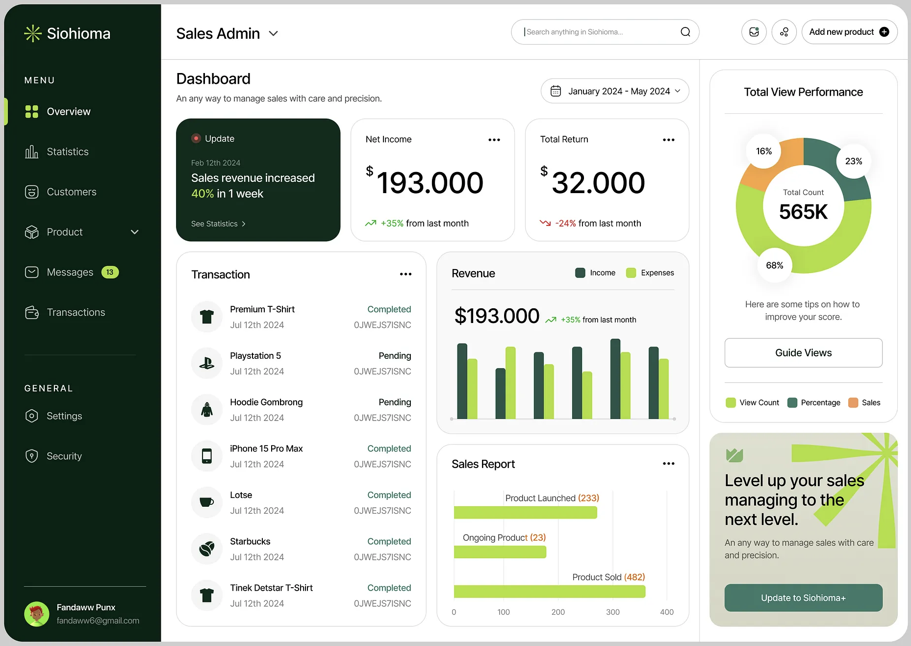

# Supermarket Sales Dashboard

A modern, interactive dashboard for visualizing supermarket sales data. This application presents key metrics and trends from a supermarket sales dataset in an intuitive and visually appealing interface.



## Features

- **Interactive Visualizations**: Dynamic charts that respond to user interactions
- **Key Performance Indicators**: At-a-glance metrics showing total revenue, customer count, average transaction value, and ratings
- **Sales Trend Analysis**: Time-series visualization of sales performance
- **Category Breakdown**: Bar charts showing sales by product category and branch
- **Demographic Insights**: Visual representation of sales by gender and payment method
- **Responsive Design**: Fully responsive layout that works on desktop and mobile devices

## Technology Stack

- **React**: Frontend framework for building the user interface
- **Recharts**: Composable charting library built on React components
- **PapaParse**: CSV parsing library for processing the sales data
- **Modern JavaScript (ES6+)**: Leveraging the latest JavaScript features

## Getting Started

### Prerequisites

- Node.js (version 14 or above)
- npm (comes with Node.js)

### Installation

1. Clone the repository:
   ```
   git clone https://github.com/yourusername/sales-dashboard.git
   cd sales-dashboard
   ```

2. Install dependencies:
   ```
   npm install
   ```

3. Start the development server:
   ```
   npm start
   ```

4. Open [http://localhost:3000](http://localhost:3000) to view the dashboard in your browser.

### Building for Production

To create a production-optimized build:

```
npm run build
```

The build files will be located in the `build` directory.

## Data Structure

The dashboard uses the `supermarket_sales.csv` file, which contains the following data points:

- Invoice ID
- Branch
- City
- Customer type
- Gender
- Product line
- Unit price
- Quantity
- Tax
- Total
- Date
- Time
- Payment method
- Cost of goods sold
- Gross margin percentage
- Gross income
- Rating

## Project Structure

```
sales-dashboard/
├── public/
│   ├── index.html
│   └── supermarket_sales.csv
├── src/
│   ├── components/
│   │   ├── BarChart.js
│   │   ├── ChartCard.js
│   │   ├── KPICard.js
│   │   ├── LineChart.js
│   │   ├── PieChart.js
│   │   └── ProgressBar.js
│   ├── hooks/
│   │   └── useData.js
│   ├── utils/
│   │   └── dataUtils.js
│   ├── App.js
│   ├── index.css
│   └── index.js
├── package.json
└── README.md
```

## Customization

### Changing Colors

The dashboard uses a consistent color palette throughout. To change colors, modify the color props in `App.js` and the color constants in the chart components.

### Adding New Visualizations

To add new visualizations:

1. Create a new chart component in the `components` directory
2. Update the data processing functions in `utils/dataUtils.js`
3. Add the new component to `App.js`

## License

This project is licensed under the MIT License - see the LICENSE file for details.

## Acknowledgments

- Supermarket sales dataset from [Kaggle](https://www.kaggle.com/datasets/aungpyaeap/supermarket-sales)
- [Recharts](https://recharts.org/) for the charting library
- [PapaParse](https://www.papaparse.com/) for CSV parsing 